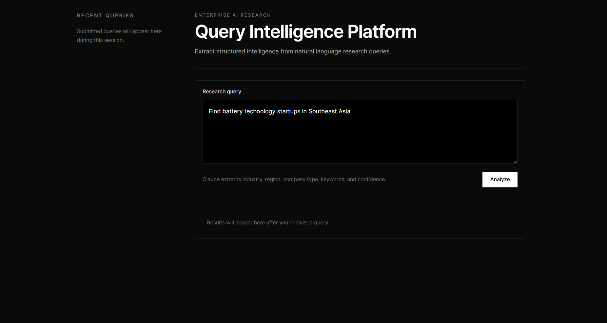
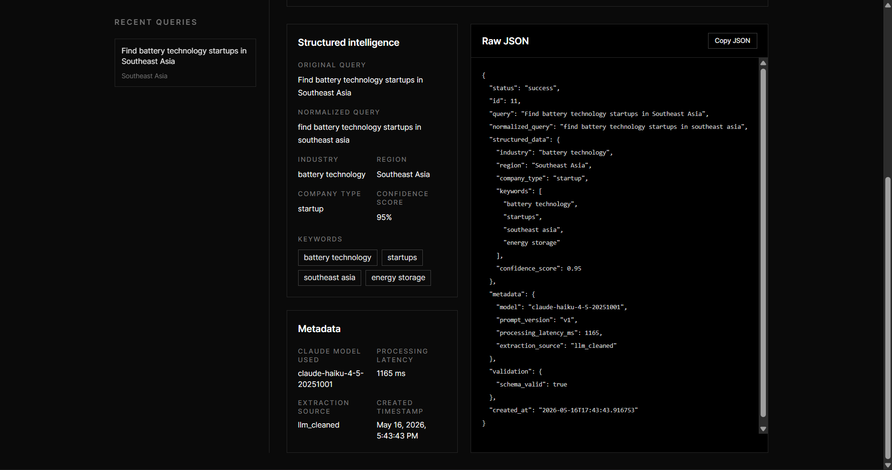

# Query Intelligence Platform

Modern full-stack platform for extracting structured intelligence from natural language research queries using FastAPI, Claude, SQLite, and a minimal React frontend.

```text
project/
├── frontend/   React + Vite + Tailwind + Axios
├── backend/    FastAPI + SQLAlchemy + Anthropic SDK
└── README.md
```

---

## Overview

The platform accepts natural language research queries such as:

```text
Find battery technology startups in Southeast Asia
```

It then:

- normalizes the query,
- extracts structured intelligence using Claude,
- validates and stores the response in SQLite,
- and displays the processed results through a modern enterprise-style frontend.

---

## Features

### Backend

- FastAPI REST API with modular service/repository architecture.
- Structured extraction using Anthropic Claude.
- SQLite persistence using SQLAlchemy ORM.
- Pydantic schema validation and response shaping.
- Query normalization and fallback parsing support.
- Metadata tracking including latency, extraction source, and prompt version.
- Configurable retries, timeout, and model selection.

### Frontend

- Minimal black-and-white enterprise-style React UI.
- Real-time query analysis and result rendering.
- Structured intelligence cards for extracted fields.
- Raw JSON response viewer with copy support.
- Lightweight in-session query history sidebar.
- Responsive layout with restrained professional styling.

---

## Backend Setup

```bash
cd backend
python -m venv venv
venv\Scripts\activate
pip install -r requirements.txt
copy .env.example .env
```

Set your Anthropic key in `backend/.env`:

```env
ANTHROPIC_API_KEY=your_anthropic_api_key_here
```

Run the backend:

```bash
uvicorn app.main:app --reload
```

Backend runs at:

```text
http://127.0.0.1:8000
```

Swagger documentation:

```text
http://127.0.0.1:8000/docs
```

---

## Frontend Setup

```bash
cd frontend
npm install
npm run dev
```

Frontend runs at:

```text
http://127.0.0.1:5173
```

---

## API Endpoints

### `POST /queries`

Accepts a natural language query, extracts structured intelligence using Claude, stores the processed result, and returns the structured response.

### `GET /queries/{id}`

Returns a previously stored query along with its extracted structured intelligence.

---

## API Example

```bash
curl -X POST http://127.0.0.1:8000/queries ^
  -H "Content-Type: application/json" ^
  -d "{\"query\":\"Find battery technology startups in Southeast Asia\"}"
```

Example response:

```json
{
  "status": "success",
  "id": 1,
  "query": "Find battery technology startups in Southeast Asia",
  "normalized_query": "find battery technology startups in southeast asia",
  "structured_data": {
    "industry": "battery technology",
    "region": "Southeast Asia",
    "company_type": "startup",
    "keywords": ["battery", "technology", "startup"],
    "confidence_score": 0.91
  },
  "metadata": {
    "model": "claude-haiku-4-5-20251001",
    "prompt_version": "v1",
    "processing_latency_ms": 842,
    "extraction_source": "llm"
  },
  "validation": {
    "schema_valid": true
  },
  "created_at": "2026-05-16T12:00:00Z"
}
```

---

## Running Sample Query Batches

The backend includes sample research queries and a lightweight runner script.

```bash
cd backend
python app/test/run_queries.py
```

Outputs are written to:

```text
backend/app/test/output/<run_id>/
```

---

## Frontend Preview






---

## What I Would Improve With More Time

### 1. Automated Integration Testing

I would add integration tests with a mocked Anthropic client to validate:

- structured extraction behavior,
- fallback parsing,
- error handling,
- and database persistence.

This would make the service more reliable and ensure extraction logic remains stable as prompts and schemas evolve.

### 2. Production-Grade Rate Limiting & Monitoring

I would add configurable rate limiting and request monitoring to better simulate a production environment. This would help:

- prevent API abuse,
- control LLM usage costs,
- monitor latency and extraction failures,
- and improve operational visibility for real-world deployment scenarios.

### 3. Query Caching & Response Optimization

I would add caching for repeated or semantically similar queries to reduce unnecessary LLM calls and improve response times. This would:

- lower API costs,
- reduce latency for frequently repeated research queries,
- and improve scalability under higher request volumes.

A lightweight Redis-based caching layer would be a good next step for production readiness.

---

# Author

**Jayneel Mukeshkumar Mahival**

Created as part of the **Spark Studios Internship Assignment**.
